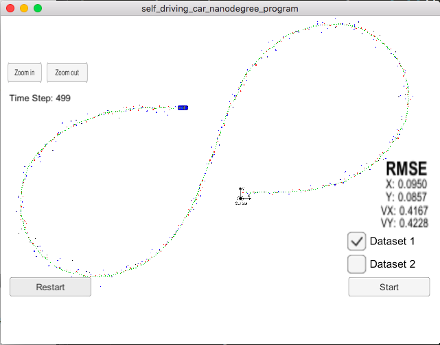
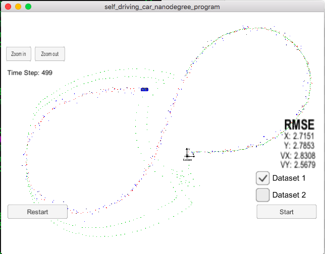

# My questions

## 1. why the way to calculate `y` makes the difference

Below is a simulator running result comparison:


The "Left" side picture shows the result of calculating y by

```
VectorXd y = z - H_ * x_;          // 3x1
```

The "Right" side picture shows the result of calculating y by

```
double rho = sqrt(x_(0)*x_(0) + x_(1)*x_(1));
double theta = atan(x_(1) / x_(0));
double rho_dot = (x_(0)*x_(2) + x_(1)*x_(3)) / rho;
VectorXd h = VectorXd(3); // h(x_)
h << rho, theta, rho_dot;
VectorXd y = z - h;
```

As can be seen from the picture, the right calculation postponed the deviation.

But, my question is, doesn't the Jacobian matrix convert the original state (vector of 4)
to a measurement space (vector 3), why need to perform the manual conversion?

the complete code show as following, `kalman_filter.cpp`:


```
void KalmanFilter::UpdateEKF(const VectorXd &z) {
    /**
    * update the state by using Extended Kalman Filter equations
    */

//    VectorXd y = z - H_ * x_;          // 3x1

    double rho = sqrt(x_(0)*x_(0) + x_(1)*x_(1));
    double theta = atan(x_(1) / x_(0));
    double rho_dot = (x_(0)*x_(2) + x_(1)*x_(3)) / rho;
    VectorXd h = VectorXd(3); // h(x_)
    h << rho, theta, rho_dot;
    VectorXd y = z - h;
    MatrixXd Ht = H_.transpose();      // 4x3
    MatrixXd S = H_ * P_ * Ht + R_;    //(3x4)*(4x4)*(4x3)+(3x3)=(3x3)
    MatrixXd K = P_ * Ht * S.inverse();//(4x4)*(4x3)*(3x3)=(4x3)
    x_ += K * y;                       //(4x3)*(3x1) = (4x1)
    P_ = (MatrixXd::Identity(4, 4) - K * H_) * P_; //((4x4) - (4x3)*(3x4)) = (4x4)
}

```

## 2. why needs to atan2?
```
void KalmanFilter::UpdateEKF(const VectorXd &z) {
    double rho = sqrt(x_(0)*x_(0) + x_(1)*x_(1));
    // double theta = atan(x_(1) / x_(0));
    double theta = atan2(x_(1), x_(0));
    double rho_dot = (x_(0)*x_(2) + x_(1)*x_(3)) / rho;
    VectorXd h = VectorXd(3); // h(x_)
    h << rho, theta, rho_dot;
    VectorXd y = z - h;
    y[1] = atan2(sin(y[1]), cos(y[1]));  
    MatrixXd Ht = H_.transpose();      // 4x3
    MatrixXd S = H_ * P_ * Ht + R_;    //(3x4)*(4x4)*(4x3)+(3x3)=(3x3)
    MatrixXd K = P_ * Ht * S.inverse();//(4x4)*(4x3)*(3x3)=(4x3)
    x_ += K * y;                       //(4x3)*(3x1) = (4x1)
    P_ = (MatrixXd::Identity(4, 4) - K * H_) * P_; //((4x4) - (4x3)*(3x4)) = (4x4)
}
```

the above code process the data correctly, both the car track and rmse meet the rubric requirements, as below image show:



to achieve the result, two modifications required:

first, perform normalization, `y[1] = atan2(sin(y[1]), cos(y[1]));  `

second, the `theta` calculation using `double theta = atan2(x_(1), x_(0));` instead of `double theta = atan(x_(1) / x_(0));`, why?
while not doing so, get the result of below:



### the rubric requires RMSE: <=[.11, .11, 0.52, 0.52]
fix the bug:
```
} else if (measurement_pack.sensor_type_ == MeasurementPackage::LASER) {
            /**
            Initialize state.
            */
            // ekf_.x_ << measurement_pack.raw_measurements_[0],
            // measurement_pack.raw_measurements_[0], 0, 0;
            ekf_.x_ << measurement_pack.raw_measurements_[0],
                       measurement_pack.raw_measurements_[1], 0, 0;
        }
```

should be `measurement_pack.raw_measurements_[1]`, 
mine is: 
[0.0950, 0.0857, 0.4167, 0.4228]   # bug
[0.0973, 0.0855, 0.4513, 0.4399]   # fix 

with the changing, the result seems has not big change. it indicates that the initial value to the whole kalman filter process has limited influence. 


