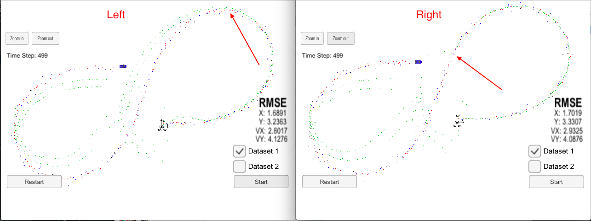

# My questions

## 1. why the way to calculate `y` makes the difference

Below is a simulator running result comparison:



The "Left" side picture shows the result of calculating y by

```
VectorXd y = z - H_ * x_;          // 3x1
```

The "Right" side picture shows the result of calculating y by

```
double rho = sqrt(x_(0)*x_(0) + x_(1)*x_(1));
double theta = atan(x_(1) / x_(0));
double rho_dot = (x_(0)*x_(2) + x_(1)*x_(3)) / rho;
VectorXd h = VectorXd(3); // h(x_)
h << rho, theta, rho_dot;
VectorXd y = z - h;
```

As can be seen from the picture, the right calculation postponed the deviation.

But, my question is, doesn't the Jacobian matrix convert the original state (vector of 4)
to a measurement space (vector 3), why need to perform the manual conversion?

the complete code show as following, `kalman_filter.cpp`:


```
void KalmanFilter::UpdateEKF(const VectorXd &z) {
    /**
    * update the state by using Extended Kalman Filter equations
    */

//    VectorXd y = z - H_ * x_;          // 3x1

    double rho = sqrt(x_(0)*x_(0) + x_(1)*x_(1));
    double theta = atan(x_(1) / x_(0));
    double rho_dot = (x_(0)*x_(2) + x_(1)*x_(3)) / rho;
    VectorXd h = VectorXd(3); // h(x_)
    h << rho, theta, rho_dot;
    VectorXd y = z - h;
    MatrixXd Ht = H_.transpose();      // 4x3
    MatrixXd S = H_ * P_ * Ht + R_;    //(3x4)*(4x4)*(4x3)+(3x3)=(3x3)
    MatrixXd K = P_ * Ht * S.inverse();//(4x4)*(4x3)*(3x3)=(4x3)
    x_ += K * y;                       //(4x3)*(3x1) = (4x1)
    P_ = (MatrixXd::Identity(4, 4) - K * H_) * P_; //((4x4) - (4x3)*(3x4)) = (4x4)
}

```


